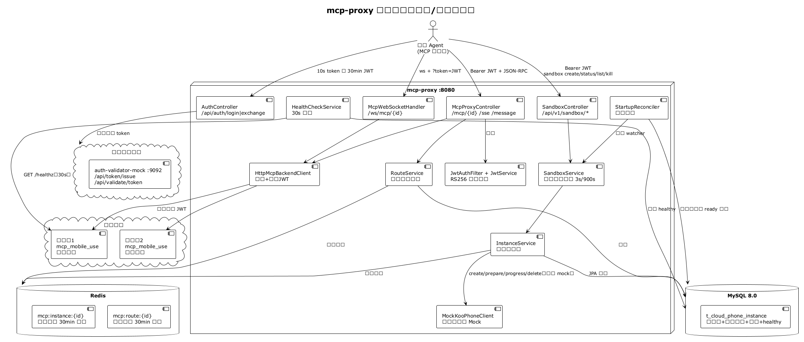
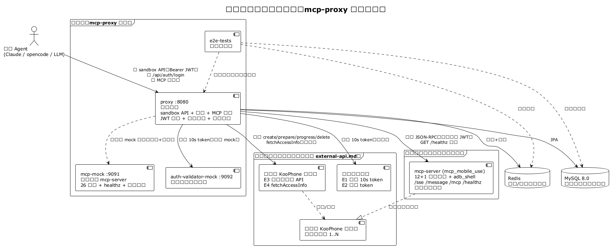
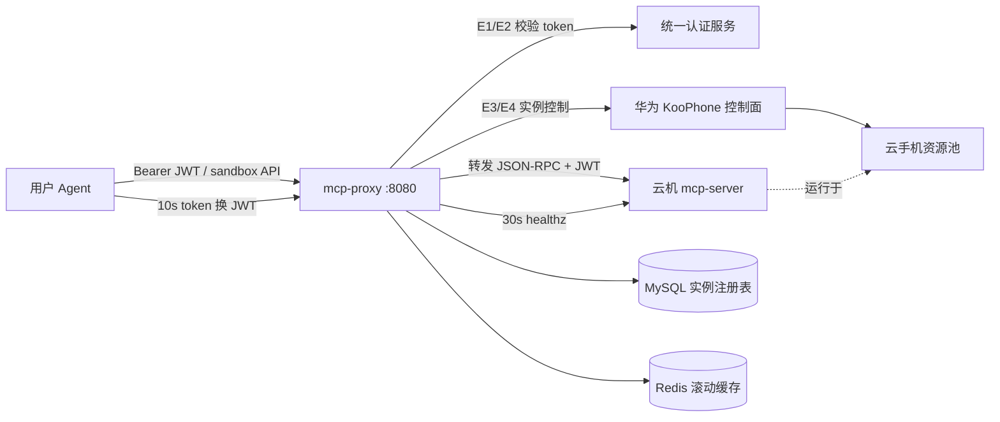
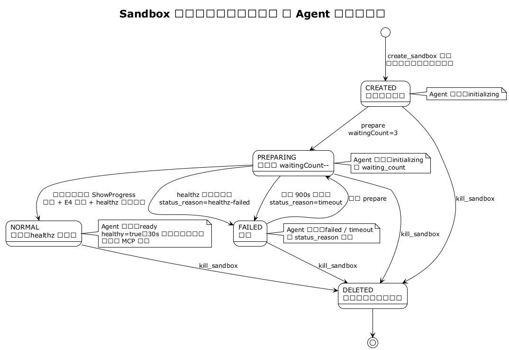
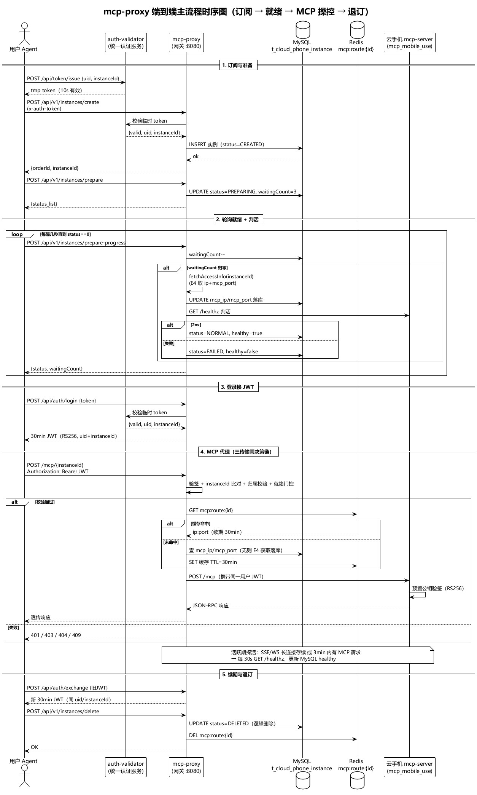
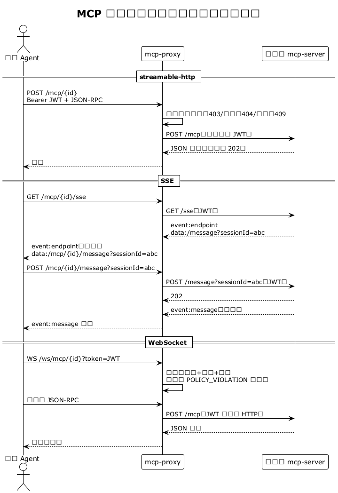
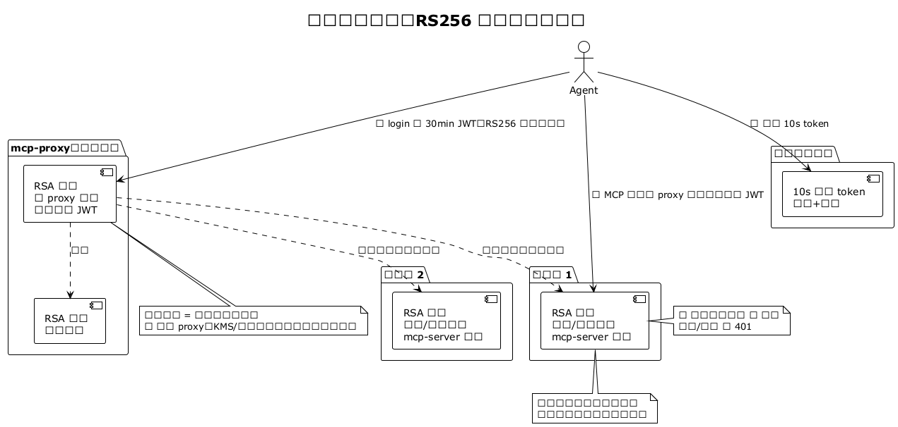
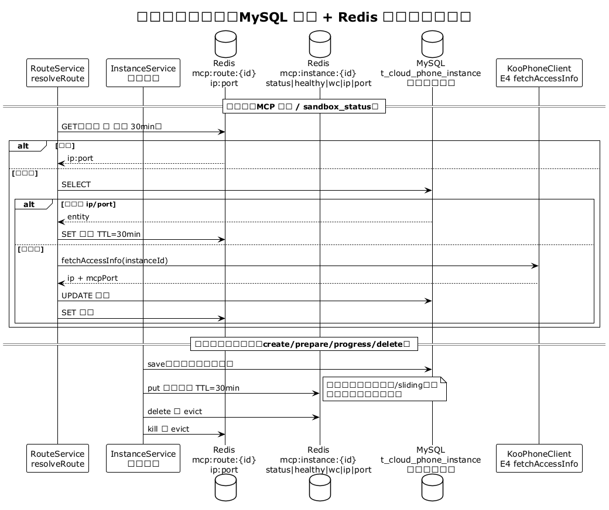
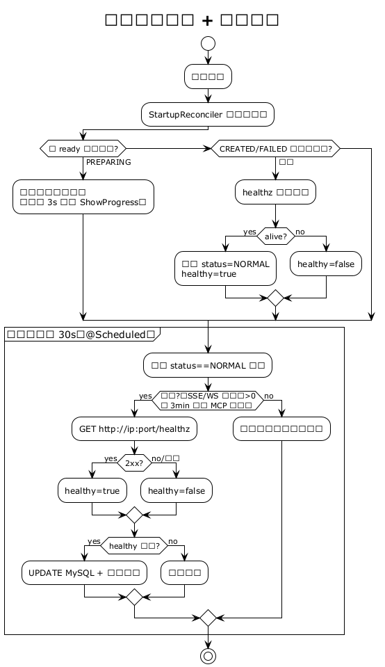

# 架构文档（Architecture）

> 版本：v1.3 ｜ 更新：2026-08-05
> 项目：mcp-proxy —— 云手机 MCP 代理网关微服务
> 所有 PNG 图由 PlantUML 生成，源码在 `docs/diagrams/*.puml`，渲染命令见 §10

## 1. 总体架构

系统解决三个核心问题：**多租户多实例路由**（Agent 按 sandbox_id 寻址自己的云手机）、
**双层令牌安全体系**（10s 临时 token → 30min RS256 JWT，云机公钥验签）、
**协议透传**（streamable-http / SSE / WebSocket 三种 MCP 传输透明代理）。
同时对 Agent 暴露**一键式 sandbox 接口**（包装华为云实例全生命周期），
实例管理细节（华为风格 create/prepare/progress/delete）是内部 mock，不对 Agent 暴露。



## 2. 外部系统与组件关系

mcp-proxy 依赖两类外部系统（字段级契约见 [external-api.md](external-api.md)）：

| 外部系统 | 依赖接口 | 当前实现 | 生产替换方式 |
|---|---|---|---|
| 统一认证服务 | E1 签发 / E2 校验 10s token | `auth-validator-mock:9092` | 修改 `koophone.validator-url` 指向真实服务 |
| 华为云 KooPhone 控制面 | E3 实例订购类、E4 访问信息 | `MockKooPhoneClient`（进程内） | 实现 `KooPhoneClient` 的华为 REST Bean 替换 |
| 云机 mcp-server | MCP 三传输 + `/healthz` + 公钥验签 | `mcp-mock:9091` | 真实云手机内 `mcp_mobile_use` |



Mermaid 版（GitHub 可直接渲染）：



## 3. 模块职责

| 模块 | 端口 | 职责 |
|---|---|---|
| `proxy` | 8080 | 统一网关：sandbox API、认证（login/exchange）、MCP 三传输代理、JWT 签发（RS256 私钥）、路由缓存（Redis）、健康检查（30s 探活）、启动校准、华为控制面编排（Mock） |
| `mcp-mock` | 9091 | 模拟云机 mcp-server：26 个工具（13 mcp_mobile_use 含 adb_shell + 13 AgentBay sandbox）、`/healthz`、RS256 公钥验签（`MCP_JWT_PUBLIC_KEY`） |
| `auth-validator-mock` | 9092 | 模拟统一认证服务：10s 临时 token 签发/校验 |
| `e2e-tests` | — | 三应用同 JVM 启动（随机端口 + profile 隔离），真实 MySQL/Redis 全流程验证 |

### proxy 内部组件

| 组件 | 职责 |
|---|---|
| `SandboxController` | Agent 唯一实例入口：create/status/list/kill（Bearer JWT） |
| `SandboxService` | 异步编排：create 启动后台看守线程（3s 轮询 ShowProgress，900s 超时） |
| `AuthController` | 10s token → 30min JWT；旧 JWT 续期 |
| `McpProxyController` | streamable-http + SSE 代理入口，决策链校验 |
| `McpWebSocketHandler` | WS 桥接（文本帧 ↔ 云机 HTTP POST） |
| `JwtAuthFilter + JwtService` | RS256 私钥签发、公钥验签，claims：uid + instanceId |
| `InstanceService` | 内部实例状态机编排（CREATED→PREPARING→NORMAL/FAILED→DELETED），事务边界 |
| `RouteService` | 三级路由解析：Redis(30min 滑动) → MySQL → E4 获取落库 |
| `HealthCheckService` | 30s 定时探活活跃实例，回写 healthy |
| `StartupReconciler` | 启动扫描非 ready 未退订实例：恢复 watcher / healthz 校准 |
| `KooPhoneClient`(Mock) | 华为控制面 mock：订单号/实例 ID/访问信息（E4） |
| `HttpMcpBackendClient` | 云机出站调用，所有请求携带用户 JWT |

## 4. Sandbox 生命周期

Agent 视角只有四个接口，内部完整包装华为实例生命周期。
create 为**异步**（真实华为开通约 1~5 分钟）：受理后立即返回 `initializing`，
后台看守线程按 3s（可配）轮询 ShowProgress，终态自毁；超过 900s（可配）未就绪置
`FAILED(status_reason=timeout)`，Agent 轮询 `sandbox_status` 得到 `timeout`。



### 后台看守线程模型

| 配置项 | 默认 | 说明 |
|---|---|---|
| `sandbox.progress-interval-ms` | 3000 | ShowProgress 轮询间隔（最低 3 秒） |
| `sandbox.progress-timeout-ms` | 900000 | 创建总超时，超时置 FAILED(timeout) |
| 终态退出 | — | NORMAL/FAILED 任一到达，线程自毁 |

## 5. 端到端时序



## 6. MCP 三种传输代理

三种传输共用同一条决策链：
**401**（无有效 JWT）→ **403**（jwt.instanceId ≠ 路径 id，或非本人实例）→
**404**（实例不存在/已退订）→ **409**（实例未就绪）→ 路由解析 → 携带用户 JWT 转发。



| 传输 | 网关入口 | 后端对接 | 会话 |
|---|---|---|---|
| streamable-http | `POST /mcp/{id}` | 同步 POST 云机 `/mcp` | 无状态 |
| SSE | `GET /mcp/{id}/sse` + `POST /mcp/{id}/message` | 云机 `/sse` + `/message` | sessionId 映射 + endpoint 重写 |
| WebSocket | `/ws/mcp/{id}?token=` | 文本帧桥接为云机 HTTP POST | 每连接一链路 |

## 7. 安全密钥体系

RS256 非对称：proxy 持**私钥**签发用户 JWT；每台云机 mcp-server 预置**公钥**验签。
proxy 转发请求时原样携带用户 JWT，云机独立验签（签名 + exp），失败 401。
公钥分发方式与轮换流程见 [security.md](security.md)。



## 8. 数据与缓存架构

MySQL 是唯一权威存储；Redis 两层滚动缓存（30min，**读命中即续期**，活跃实例永不过期）：

| 缓存 | Key | Value | 用途 |
|---|---|---|---|
| 路由缓存 | `mcp:route:{id}` | `ip:port` | MCP 转发寻址 |
| 实例状态缓存 | `mcp:instance:{id}` | `status\|healthy\|waitingCount\|ip\|port` | sandbox_status 读路径 |



## 9. 健康检查与启动校准

- **就绪判活**：ShowProgress 归零时先 E4 落库，再调 `GET /healthz`，活则 NORMAL，死则 FAILED；
- **活跃期探活**：每 30s 对"活跃"实例（SSE/WS 长连接存续，或 3min 内有 MCP 请求）调 healthz，回写 `healthy`；
- **启动校准**：proxy 重启后扫描非 ready 未退订实例——PREPARING 恢复看守线程，CREATED/FAILED 做一次 healthz 并校准状态（活 → NORMAL）。



## 10. 图表再生成

```bash
java -jar plantuml.jar -tpng -charset UTF-8 docs/diagrams/*.puml
```

| 图 | PlantUML 源码 |
|---|---|
| 总体架构 | `docs/diagrams/arch-overview.puml` |
| 外部系统关系 | `docs/diagrams/external-systems.puml` |
| Sandbox 状态机 | `docs/diagrams/sandbox-state.puml` |
| 端到端时序 | `docs/diagrams/e2e-sequence.puml` |
| MCP 三传输 | `docs/diagrams/mcp-transports.puml` |
| 安全密钥体系 | `docs/diagrams/security-keys.puml` |
| 数据与缓存 | `docs/diagrams/cache-data.puml` |
| 健康检查闭环 | `docs/diagrams/health-loop.puml` |
| 业务活动图 | `docs/diagrams/business-activity.puml` |
